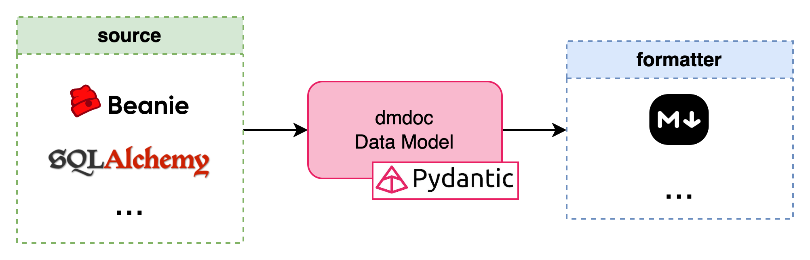

# dmdoc-python
A Python package for data model documentation generator.

**Why:** keeping data model documentation up to date is boring.

**How:** a utility that produces the documentation directly from the code by:
* scanning data models from Python ORM/ODM libraries;
* producing the documentation in various formats.

Doing this way, developers only need to write entity and field descriptions in the source code and
`dmdoc` takes care of everything else (e.g. data types, keys, relationships, ...).  

Main features:
* A CLI to produce data model documentation;
* Pluggable sources, sinks and data types.

### Table of Content
* [Overview](#overview)
* [Usage](#usage)
  * [Installation](#installation)
  * [CLI](#cli)
  * [Extending dmdoc](#extending-dmdoc)
* [Sources](#sources)
  * [SQLAlchemy](#sqlalchemy)
  * [Beanie](#beanie)
  * [Creating custom sources](#creating-custom-sources)
* [Formats](#formats)
  * [Markdown](#markdown)
  * [Creating custom formats](#creating-custom-formats)
* [Data types](#data-types)
  * [Creating custom data types](#creating-custom-data-types)
* [Coming next](#coming-next)

## Overview
Definitions:
* *Source*: represents the source technology, where the data model is defined (typically an ORM/ODM library).
* *Format*: an object that parses data models to a documentation format.
* *Sink*: a shared model (Pydantic class) that represents a bridge between source and format.

Basically, source entities are parsed and dumped to the sink.
Then, the format is provided as input to the format which generates the documentation.



Using the sink makes easier to add new sources or output formats, because there is no need to write code to parse
all combinations of sources and formats.

## Usage

### Installation
To install the package inside a new Python venv run the following:
```commandline
python -m venv .venv
source .venv/bin/activate
pip install --upgrade pip
pip install -e .
```

### CLI
The CLI entry point is `dmdoc`. In the following sections are described available commands.

A command help is available too:
```commandline
dmdoc --help
```

#### generate
The main command, used to generate documentation.

Usage:
```commandline
dmdoc generate -s "path/to/source/config.yaml" -f "path/to/source/config.yaml"
```

### Extending dmdoc
Each architecture component is pluggable: if an *out-of-the-box* source, data type of format
does not fit the user use case, a custom component can be created:

Sources, data types and formats are registered as Python plug-in (entry points).
The only thing to do is to extend the base abstractions and register a new entrypoint.
For more details check out the related section of this document.

## Sources
A source is identified by its name and must be registered as entrypoint at `dmdoc.sources`.
The entrypoint value is a Python class that inherit from `dmdoc.core.source.Source`.
Child classes implement two methods:
* *get_config_class* (optional): returns a Pydantic model, which is used to read source configuration parameters;
* *_do_parse*: the main method that returns a `dmdoc.core.sink.model.DataModel` instance.
The parsing process starts reading a source configuration file, which is a **.yaml** defined as follows:

```yaml
type: <source-name>
config:
  ...
```

Where:
* **type** is used to identify and load the source class (aka the entrypoint value);
* **config** is an object that contains all parameters needed to read the source data model.

Available *out-of-the-box* sources are:
* [sqlalchemy](#sqlalchemy)
* [beanie](#beanie)

### SQLAlchemy
This source scans [SQLAlchemy](https://www.sqlalchemy.org/) data models.
Both declarative and imperative mapping are supported.

* *name*: `sqlalchemy`
* *source class*: `dmdoc.core.source.sqlalchemy_source.SQLAlchemySource`
* *source config*: `dmdoc.core.source.sqlalchemy_source.SQLAlchemySourceConfig`

This source requires the installation of an optional dependency:
```commandline
pip install dmdoc[sqlalchemy]
```

Examples of configuration files:
* [sqlalchemy-declarative.yaml](scripts/data/source/sqlalchemy-declarative.yaml) for declarative mapping;
* [sqlalchemy-imperative.yaml](scripts/data/source/sqlalchemy-imperative.yaml) for imperative mapping.

### Beanie
This source scans [Beanie](https://beanie-odm.dev/) data models.

* *name*: `beanie`
* *source class*: `dmdoc.core.source.beanie_source.BeanieSource`
* *source config*: `dmdoc.core.source.beanie_source.BeanieSourceConfig`

This source requires the installation of an optional dependency:
```commandline
pip install dmdoc[beanie]
```

An example of configuration file can be found [here](scripts/data/source/beanie.yaml).

> Using this source, a non-standard data type is registered: ObjectId.

### Creating custom sources

###### 1) Give a name to the source
Choose a source name making sure that an existing one has not the same name.
This name will be written as value of the **type** property of the yaml configuration file.

For this example the name `my-custom-source` will be used.

###### 2) Define the source configuration class
Create a configuration class that extends `pydantic.BaseModel`.

This class is a container to dump the **config** property in the yaml configuration file.

```python
from pydantic import BaseModel

class CustomSourceConfig(BaseModel):
    # configuration fields here...
    pass
```

###### 3) Define the source class
Create a configuration class that extends `dmdoc.core.source.Source`
and implement *get_config_class* and *_do_parse* methods.

Note that from inside the class, config object can be accessed via **_config** instance attribute.

```python
from dmdoc.core.source import Source
from dmdoc.core.sink.model import DataModel

class CustomSource(Source):
    
    @classmethod
    def get_config_class(cls) -> type[CustomSourceConfig]:
        # this is the class defined in the previous step
        return CustomSourceConfig

    def _do_parse(self) -> DataModel:
        # implementation here
        return DataModel(
            ...
        )
```

###### 4) Register the source class as new entrypoint value
Create a new *setup.py* (or *pyproject.toml*, or similar) file to register the source class.

> If the project is a package, the entrypoint can be registered as entrypoint of that package.

```python
from setuptools import setup

setup(
    # ...,
    entry_points={
        'dmdoc.sources': [
            'my-custom-source = package.path.to.my.source.class:CustomSource',
        ]
    }
)
```

###### 5) Use the new source
Create a yaml configuration file for the source and pass it to the **dmdoc generate** command.

```yaml
type: my-custom-source
config:
  ...
```

## Formats
Formats design is quite similar to sources.
A format is identified by its name and must be registered as entrypoint at `dmdoc.formats`.
The entrypoint value is a Python class that inherit from `dmdoc.core.format.Format`.
Child classes implement two methods:
* *get_config_class* (optional): returns a Pydantic model, which is used to read source configuration parameters;
* *_do_generate*: the main method that produces the documentation.
As well as sources, the generation process consists of reading a source configuration file, which is a **.yaml** defined as follows:

```yaml
type: <format-name>
config:
  ...
```

Where:
* **type** is used to identify and load the format class (aka the entrypoint value);
* **config** is an object that contains all parameters needed to produce the documentation.

Available *out-of-the-box* formats are:
* [markdown](#markdown)

### Markdown
This format parses a sink data model to Markdown file.

* *name*: `markdown`
* *format class*: `dmdoc.core.format.markdown_format:MarkdownFormat`
* *format config*: `dmdoc.core.format.markdown_format:MarkdownFormatConfig`

This format requires the installation of an optional dependency:
```commandline
pip install dmdoc[markdown]
```

An example of configuration file can be found [here](scripts/data/format/markdown.yaml).
Examples of output Markdown documentation can be found [here](scripts/data/output/markdown).

### Creating custom formats
The procedure is quite similar to the creation of a new source

###### 1) Give a name to the format
Choose a format name making sure that an existing one has not the same name.
This name will be written as value of the **type** property of the yaml configuration file.

For this example the name `my-custom-format` will be used.

###### 2) Define the format configuration class
Create a configuration class that extends `pydantic.BaseModel`.

This class is a container to dump the **config** property in the yaml configuration file.

```python
from pydantic import BaseModel

class CustomFormatConfig(BaseModel):
    # configuration fields here...
    pass
```

###### 3) Define the format class
Create a configuration class that extends `dmdoc.core.format.Format`
and implement *get_config_class* and *_do_generate* methods.

Note that from inside the class, config object can be accessed via **_config** instance attribute.

```python
from dmdoc.core.format import Format

class CustomFormat(Format):
    
    @classmethod
    def get_config_class(cls) -> type[CustomFormatConfig]:
        # this is the class defined in the previous step
        return CustomFormatConfig

    def _do_generate(self):
        # implementation here
        ...
```

###### 4) Register the format class as new entrypoint value
Create a new *setup.py* (or *pyproject.toml*, or similar) file to register the format class.

> If the project is a package, the entrypoint can be registered as entrypoint of that package.

```python
from setuptools import setup

setup(
    # ...,
    entry_points={
        'dmdoc.formats': [
            'my-custom-format = package.path.to.my.format.class:CustomFormat',
        ]
    }
)
```

###### 5) Use the new format
Create a yaml configuration file for the format and pass it to the **dmdoc generate** command.

```yaml
type: my-custom-format
config:
  ...
```

## Data types
Data types are defined as pluggable entrypoints at `dmdoc.datatypes`.
List of available *out-of-the-box* data types:
* Primitive types:
  * boolean
  * integer
  * number
  * bytes
  * string
  * date
  * datetime
  * time
* Complex types
  * enum
  * array
  * map
  * union
  * object

### Creating custom data types
Unlike custom sources and formats, this procedure will break the paradigm of *“avoid writing new code for each combination“*.
A new data type needs to be parsed correctly by the source and formatters need to generate its documentation metadata.

###### 1) Give a name to the data type
Choose a data type name making sure that an existing one has not the same name.
This name is the value used by pydantic as discriminator in the `type` field.

For this example the name `my-custom-datatype` will be used.

###### 2) Define the data type class
Create a data type class that extends `pydantic.BaseModel`.

This class is a container to write the properties of the custom data type.
The data type class is needed even if the data type does not have additional properties
(in that case, the `dmdoc.core.sink.data_type.PrimitiveType` might be useful).

```python
from pydantic import BaseModel

class CustomDatatype(BaseModel):
    # properties fields here...
    pass
```

###### 3) Register the datatype class as new entrypoint value
Create a new *setup.py* (or *pyproject.toml*, or similar) file to register the datatype class.

> If the project is a package, the entrypoint can be registered as entrypoint of that package.

```python
from setuptools import setup

setup(
    # ...,
    entry_points={
        'dmdoc.datatypes': [
            'my-custom-datatype = package.path.to.my.datatype.class:CustomDatatype',
        ]
    }
)
```

###### 4) Parse the datatype inside sources and formatters
All sources and formats where the new data type is used, needs to manage it during parsing/generation procedure.

## Coming next
The project is developed on need. Thus, it lacks of the following features:
* Support for OGM. The sink model does not fit very well with graph schemas: a re-design might be needed.
* Support for polymorphic object types. The sink model, as well as sources and formats, does not support polymorphic objects.
* Extend the supported list of data types for Beanie and SQLAlchemy. Both sources are not widely tested and used, some data types are not mapped.
* CLI command to
  * Show sink data model documentation as *jsonschema*
  * List available source, data type and format
  * Show source, data type and format documentation
